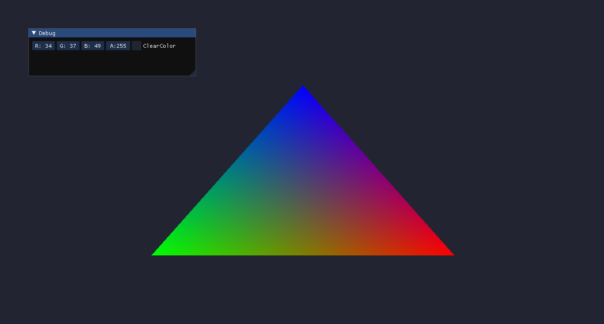
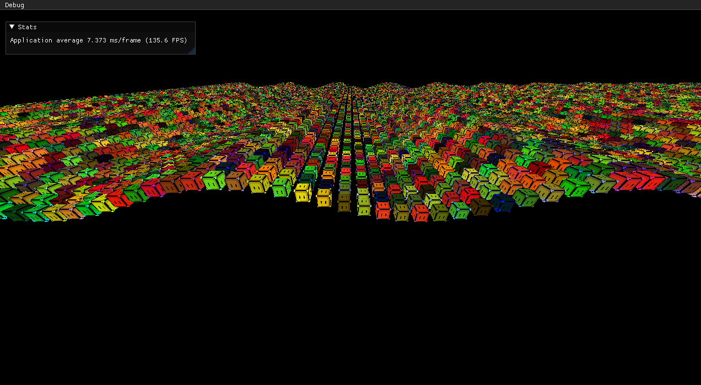

# Valiance

My poor attempt at making a game engine with OpenGL.
It is named "Valiance" because i want to try to recreate Valorant with it.
p.s: i love valorant <3

##### Dependencies:
- [Premake 5](https://github.com/premake/premake-core)
- [Glad](https://github.com/Dav1dde/glad) (Version 4.6 Compatibility Profile) 
- [GLFW](https://github.com/glfw/glfw) 
- [ImGui](https://github.com/ocornut/imgui) 
- [glm](https://github.com/g-truc/glm)

## Getting Started

Only Tested in Visual Studio 2019

Start by cloning the repository with `git clone https://github.com/ricardonunosr/valiance`.

Windows:

Run the bat `WinGenerateProjects.bat` this will run premake and generate Solutions files for Visual Studio 2019.

## Examples

##### 01-HelloWorld

  

##### 02-Instancing

  

## Acknowledgements

- Highly inspired by [Hazel](https://github.com/TheCherno/Hazel) by [TheCherno](https://github.com/TheCherno)
